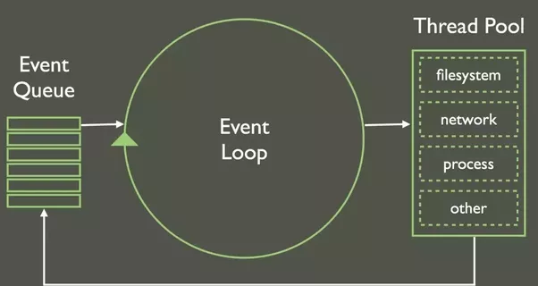

# Le javascript est une syntaxe

## neolectron — 29/05/2019 :

**le javascript est une syntaxe** (a prendre avec des pincettes - lisez bien)

Le js n'a **pas** de stdlib qui permet de lire des fichiers, ça ne peut pas non plus manipuler du html, ni envoyer des requêtes réseau.

**le js n'a pas d'io**

le js ça peut rien faire.. c'est **purement algorithmique**.

ça contient que des while, des if des for.
ça contient quelques types a la con (primitifs ou non), genre Number Array Object Date etc...
donc on peut RIEN faire en javascript. surtout que ... ça n'a pas interpréteur officiel.

donc le js c'est juste une norme, en gros c'est un bout de papier qui dit "quand on tape ça , ça doit faire ça"
(papier rédigé par la société ECMA qui gère aussi la norme du C# btw)
tu peux run du js nulle part par defaut. le programme qui run du js n'existe pas...

--

donc comment ça marche ?

--

les navigateurs ont du implémenter chacun pour leur gueule, un programme qui parse le js, et qui exécute les bonnes instructions en conséquence.

donc ils ont crée des interpréteurs js, qui parse du js et run des trucs en C ou ASM en backend finalement.

sachant que les navigateurs faisaient plus ou moins ce qu'ils voulaient a l'époque, personne vérifiait réellement si tout était normalisé.

donc certains implémentaient des trucs que d'autres n'avaient pas et vice versa.
le seul truc qu'ils avaient en commun, c'est qu'ils devaient injecter dans le langage, des fonctions pour manipuler le HTML sinon ça servirait a rien.
(encore une fois chacun a leur sauce)

--

suite ça on en arrive en 2000, quand les devs en ont eu marre que tout les navigateurs implémentaient leur merde a leur sauce,

donc ils ont fait une lib super-lourde qui fait des if, pour savoir quelle api appeler en fonction des navigateurs.

cette lib c'est jQuery. ça sert QUE a faire des if pour voir si le navigateur implémente ou non la feature que tu veux utiliser.

--

aujourd'hui la plupart des navigateurs suivent a la lettre les normes ECMA, et le support a bien progressé.
(du coup si tu veux pas de support de vieux browser jQuery ne sert qu'a avoir des perfs pourries sur ton site.)

--

ducoup on en était là. on a une syntaxe un peu universelle qui run sur différents interpréteurs.

c'est la guerre des navigateurs , tout le monde s'y met, microsoft/mozilla/apple/google,

spoil: google a gagné.

pourquoi ? => leur navigateur est plus rapide.
pourquoi ? => leur moteur js est plus rapide.

--

donc finallement la guerre des navigateurs c'était une guerre des engine JS.

--

là certains mecs qui aimaient bien la syntaxe du js se sont dit que ça serait chouette d'en faire un langage, et d'avoir une stdlib,

pour lire des fichiers ou même envoyer des requêtes réseau.. ce genre de trucs qui permettraient de faire du js un vrai langage.

Ces mecs, s'appelle la team node (meme si c'était ptet pas les premier a avoir eu l'idée).

Ils ont codé une api en C++ qui permet d'ouvrir/lire/écrire dans des fichiers, faire des requêtes etc etc.

Ils l'ont juste injecté dans le moteur javascript de google (celui qui est dans chrome [le v8 de son pti nom]) et voilà.
On a un moteur js codé par google qui a une stdlib dedans qui peut faire autant de choses que d'autres langages :)
et ça c'est node-js.

--

pour dive un peu plus dans node :
la team node a décidé de faire un language avec des io non-bloquantes.
ce que ça veut dire, c'est que chaque io (des operations sur fichier / network / autres) serait asynchrone.

en gros ça fonctionne avec une file d'attente, par ex :

1- tu fais ta demande de request réseau.

2- node enregistre une fonction nommée callback, qui sera déclenchée a la fin de ta request.

2- tout le reste de ton code continue de s'exécuter même si cette request est pas finie (oui c'est ça l'async)

3- quand la reponse a ta request réseau revient dans l'engine node, ils appellent ton callback en lui filant en paramètre la réponse.

4- le code dans ta fonction de callback s'exécute.

voilà ce que c'est node.

(le schéma de base qui aide pas mal a se représenter le runtime)

